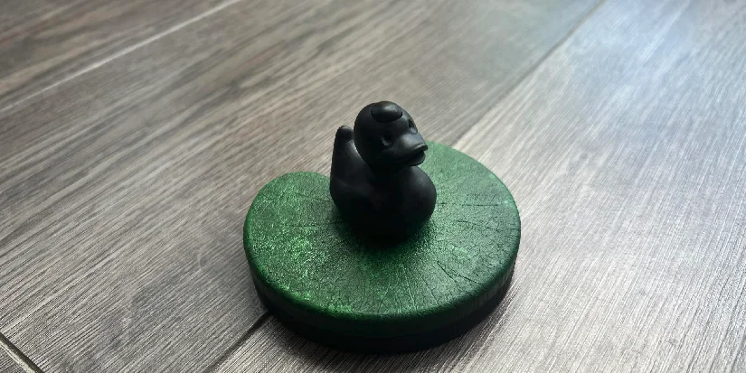

# Turbo Duck Project


[//]: # (This project was created as a playful gesture to bring a bit of humor into the workplace. I have a tradition of giving rubber ducks to the developers I work with, as they have a special place in the IT world as a debugging aid. This connected duck takes the joke to the next level. Enjoy the Turbo Duck and happy debugging!)

## Overview
Turbo Duck is a maybe duck, interactive project featuring a rubber duck with RGB LED eyes, a button, and a speaker. When the button is pressed, the duck's eyes light up in a rainbow pattern and a sound is played through the speaker. This project uses an ESP32 microcontroller and is developed using the PlatformIO environment.

## Hardware Components
- ESP-WROOM32 Development Board
- LED stripe (2 LEDs)
- Speaker
- Button
- Rubber Duck (for housing the components)

## Software Components
- Arduino framework
- Adafruit NeoPixel library for controlling the RGB LEDs
- XT_DAC_Audio library for handling audio playback

## Installation
### PlatformIO Setup
1. Ensure you have PlatformIO installed. If not, install it from [PlatformIO Installation Guide](https://docs.platformio.org/en/latest/core/installation.html).
2. Clone this repository to your local machine.
3. Open the project folder in your preferred PlatformIO IDE (e.g., VSCode).

### PlatformIO Configuration
Your `platformio.ini` file should look like this:
```ini
[env:esp32dev]
platform = espressif32
board = esp32dev
framework = arduino
monitor_speed = 115200
lib_deps = 
    XT_DAC_Audio-4_2_1.zip ; fix: https://esp32.com/viewtopic.php?t=27178#p99673
    adafruit/Adafruit NeoPixel@^1.12.2
```

### Project Structure
```
TurboDuck/
├── platformio.ini
├── src/
│   ├── main.cpp
│   ├── config/
│   │   └── pins.h
│   └── assets/
│       └── default_sound.h
```

## Code Explanation
### Main Code (`src/main.cpp`)
This is the main file where the setup and loop functions are defined.

```cpp
#include <Arduino.h>
#include <XT_DAC_Audio.h>
#include <Adafruit_NeoPixel.h>
#include "config/pins.h"
#include "assets/default_sound.h"

Adafruit_NeoPixel eyes(2, PIN_EYES, NEO_GRB + NEO_KHZ800);
XT_Wav_Class Sound(default_sound);
XT_DAC_Audio_Class DacAudio(PIN_SPEAKER, 0);
bool musicPlayed = false;

void setup() {
  pinMode(PIN_BUTTON, INPUT_PULLUP);
  eyes.begin();
  eyes.setBrightness(100);
}

void loop() {
  if (!musicPlayed) {
    DacAudio.FillBuffer();
    if (Sound.Playing) {
      eyes.rainbow((millis() / 6 % 1280) * 256);
    } else {
      musicPlayed = true;
      eyes.clear();
    }
    eyes.show();
  } else {
    delay(100);
  }

  if (digitalRead(PIN_BUTTON) == LOW) {
    musicPlayed = false;
    DacAudio.Play(&Sound);
  }
}
```

### Pin Configuration (`src/config/pins.h`)
This file defines the pins used for the RGB LEDs, speaker, and button.

```cpp
#ifndef CONFIG_PINS
#define CONFIG_PINS

#define PIN_EYES 4
#define PIN_SPEAKER 25
#define PIN_BUTTON 2

#endif /* CONFIG_PINS */
```

### Default Sound (`src/assets/default_sound.h`)
This file contains the audio data to be played when the button is pressed.

```cpp
#include <Arduino.h>

#define default_sound_len 218888
#define default_sound_freq 16000

const uint8_t default_sound[default_sound_len] PROGMEM = {
  //...
};
```

## Usage
1. Connect the hardware components to the ESP32 board as per the pin definitions.
2. Upload the code to the ESP32 using PlatformIO.
3. Press the button on the duck to see the RGB LEDs light up and hear the sound through the speaker.

## Troubleshooting
- Ensure all connections are secure and correctly mapped to the defined pins.
- Check the serial monitor (set to 115200 baud) for any debug messages or errors.

## Contributing
Feel free to fork this repository and submit pull requests for improvements or additional features.

## License
This project is open-source and available under the MIT License. See the LICENSE file for more details.

---

Enjoy your Turbo Duck project! If you encounter any issues or have suggestions, please open an issue on the repository.